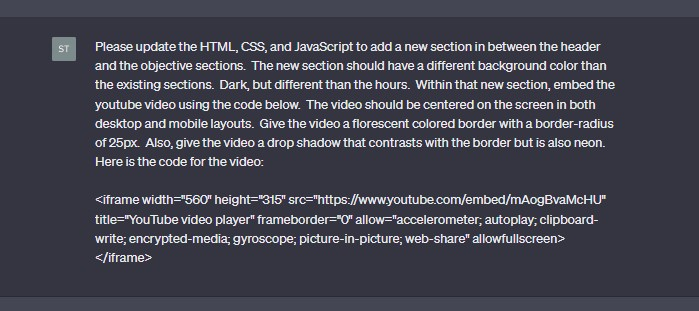
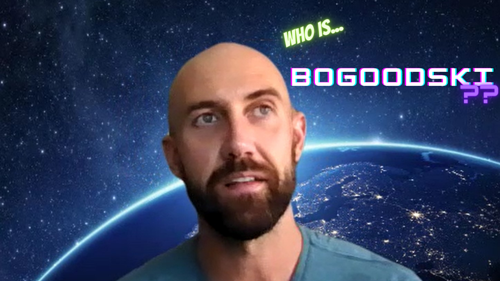
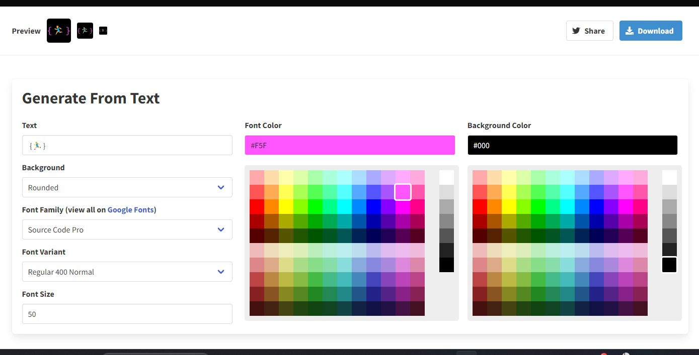
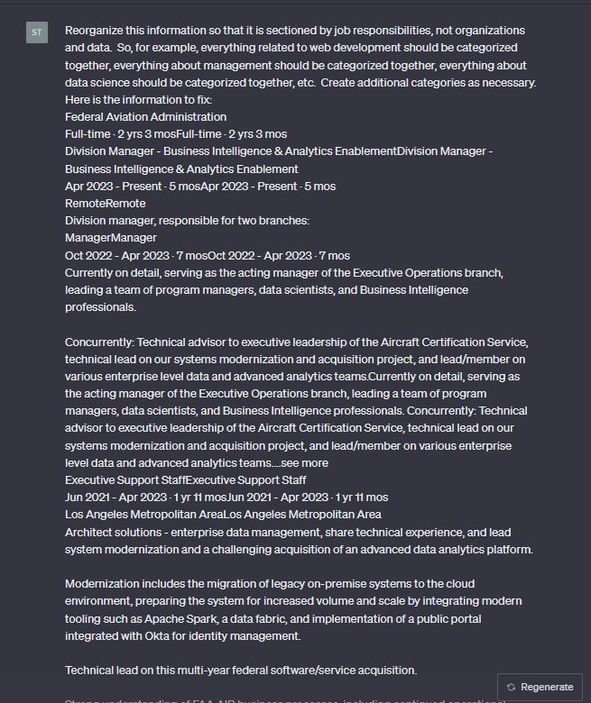
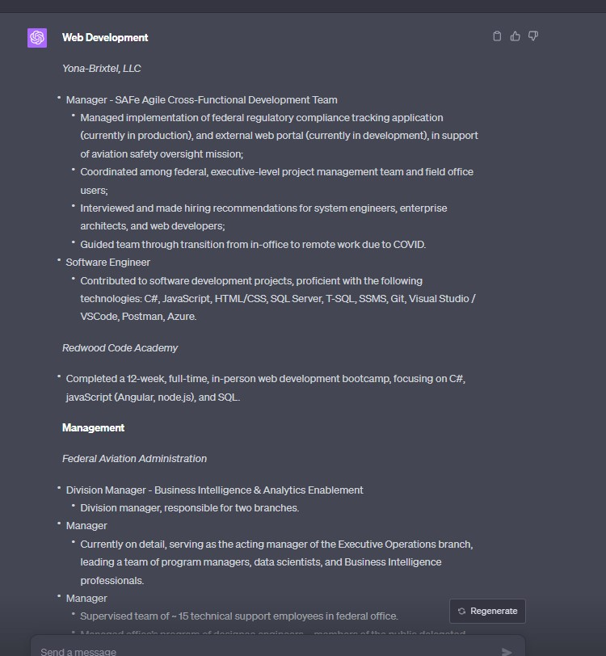
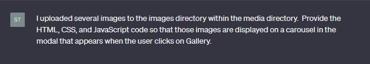
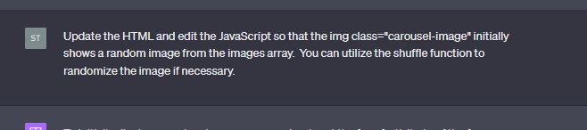
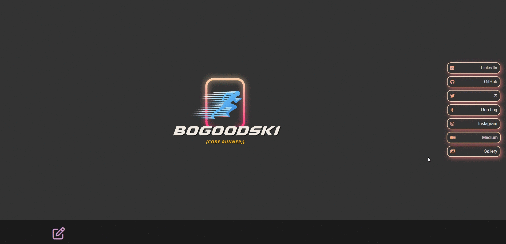
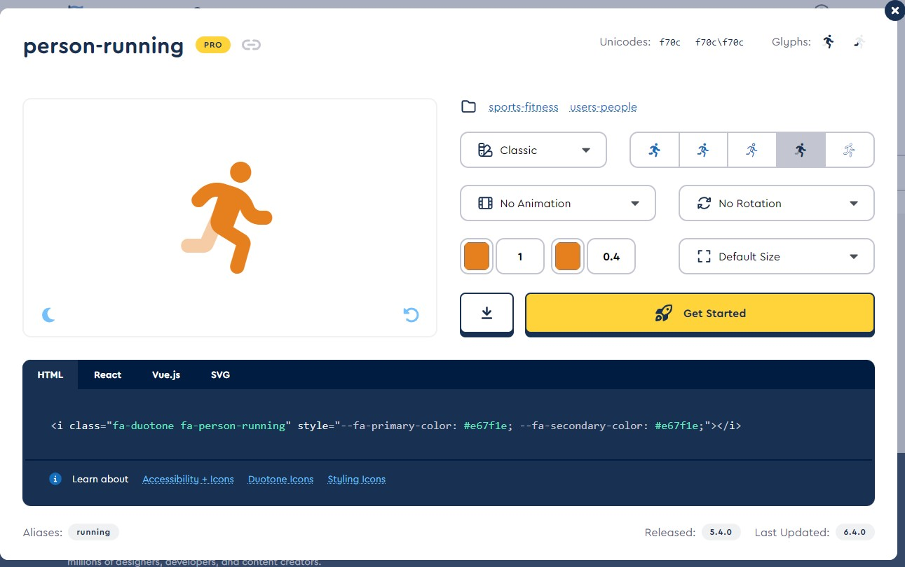
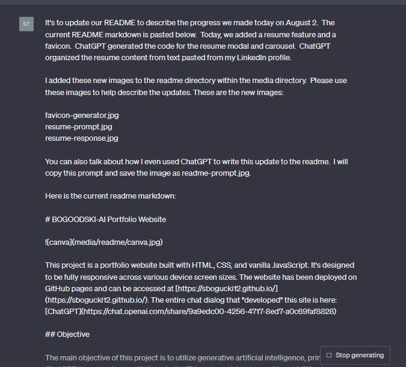

# BOGOODSKI-AI Portfolio Website

This project is a portfolio website built with HTML, CSS, and vanilla JavaScript. It's designed to be fully responsive across various device screen sizes. The website has been deployed on GitHub pages and can be accessed at [https://sbogucki12.github.io/](https://sbogucki12.github.io/). The entire chat dialog that "developed" this site is here: [ChatGPT](https://chat.openai.com/share/c6599edc-b2e6-4c26-a9fd-78e6c78d456c)

## Objective

The main objective of this project is to utilize generative artificial intelligence, primarily ChatGPT, to generate a portfolio website. This approach leverages AI capabilities to streamline and enhance the web development process.

## Progress

- **Day 3: Aug. 3, 2023:**

On day 3, we added a new section to the website that contains an embedded YouTube video. This video is centrally aligned on the screen for both desktop and mobile layouts and is styled with a fluorescent colored border and a contrasting neon drop shadow. The video's caption is subtly styled with a fluorescent neon color that is subdued with a lower opacity. The caption's text aligns with the right edge of the container, and on mobile devices, the font size is adjusted to fit on one row. 

Video Embed Prompt:

Video Thumbnail:

- **Day 2: Aug. 2, 2023:**

On day 2, we added a resume feature and a favicon to the website. The resume feature consists of a modal that contains a carousel with different sections of the resume. This content was structured and styled by ChatGPT based on text provided from a LinkedIn profile. The favicon addition helps to identify the website in browser tabs.

Favicon:

Resume Prompt:

Resume Response:

- **Day 1: Aug. 1, 2023:** 

On day 1, we made significant progress by adding a modal and an image carousel to the website. These features enhance the interactivity and visual appeal of the site.

Dynamic layout for mobile and desktop: 

Modal and Carousel:

- **Day 0: July 31, 2023:** 

The project started with basic scaffolding and style application to the website.

## Features

- **Dynamic resizing:** The website layout adjusts dynamically to fit different device screen sizes.

- **Modal and Carousel:** The website features a modal that houses an image carousel, adding an interactive visual element to the site.

- **Resume Feature:** The resume feature provides detailed professional experience, education, and other qualifications in a modal with a carousel for easy navigation.

- **Favicon:** A favicon has been added for better identification of the website in browser tabs.

- **Video Section:** The website features an embedded YouTube video in a separate section with unique stylings.

- **Local development:** Utilize a quick python server to view website during development.

## Development Process

1. **Initial Prompt:** The project started with an initial prompt, outlining the requirements and objectives for the website.

2. **Initial Scaffold:** The website was scaffolded with basic HTML structure and CSS styling.

3. **ChatGPT Assistance:** ChatGPT was used to generate and refine the HTML, CSS, and JavaScript code for the website, including the creation of a modal, an image carousel, a resume feature, a favicon, and a video section.

## Deployment

The website has been deployed on GitHub pages and can be accessed [here](https://sbogucki12.github.io/).

## Future Enhancements

    * Add a blog section
    * Add a contact form (something more complex to challenge the AI with)

## Credits

This project was created by [BOGOODSKI](https://www.linkedin.com/in/sbogucki12/). The AI, ChatGPT, provided substantial assistance in generating the code for the website and even helped in writing this update to the readme.

