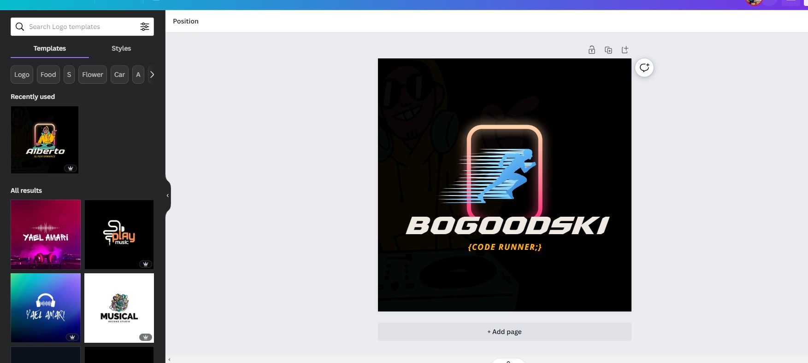
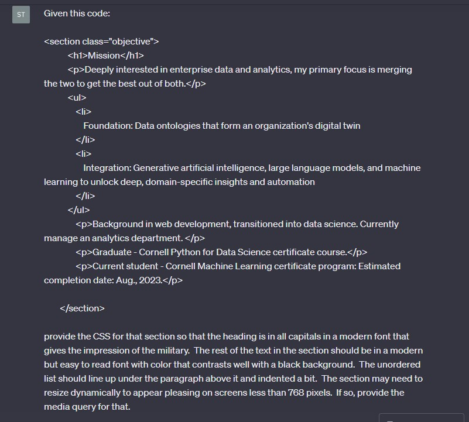
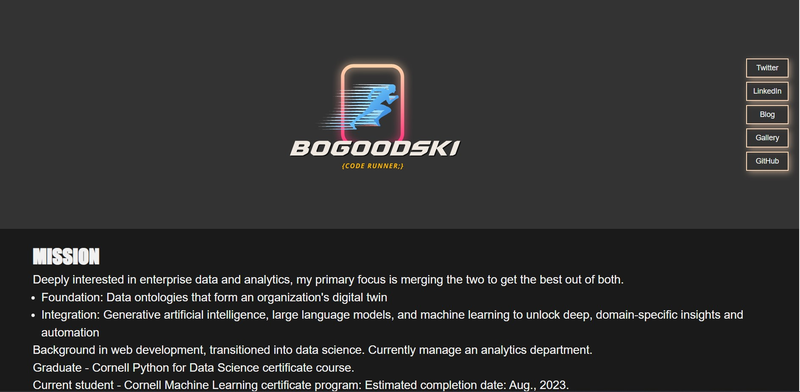
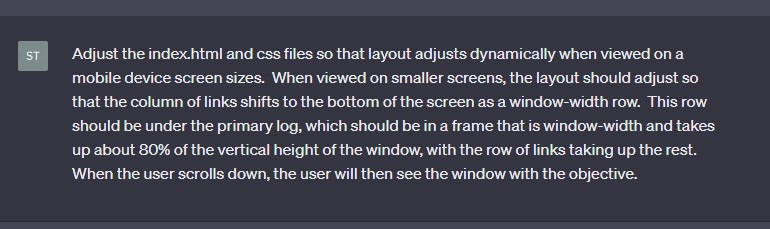
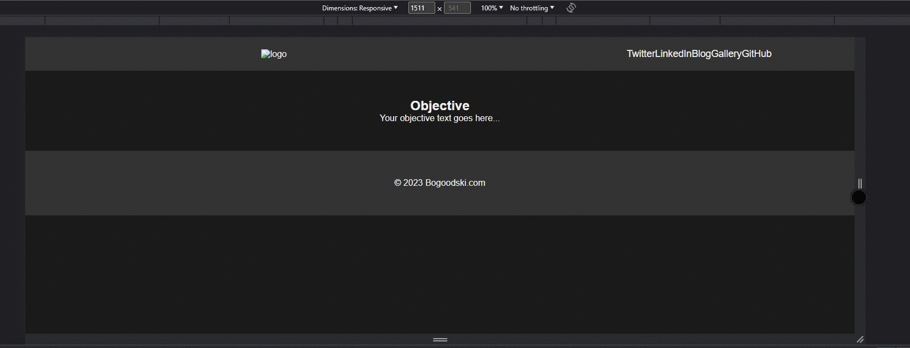
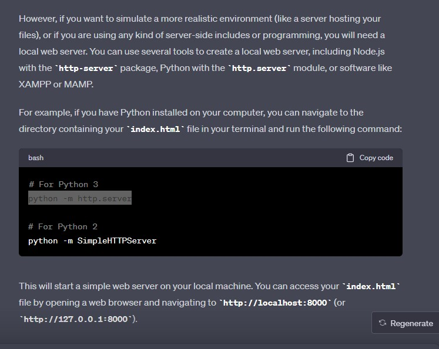
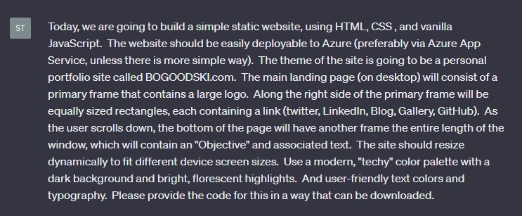
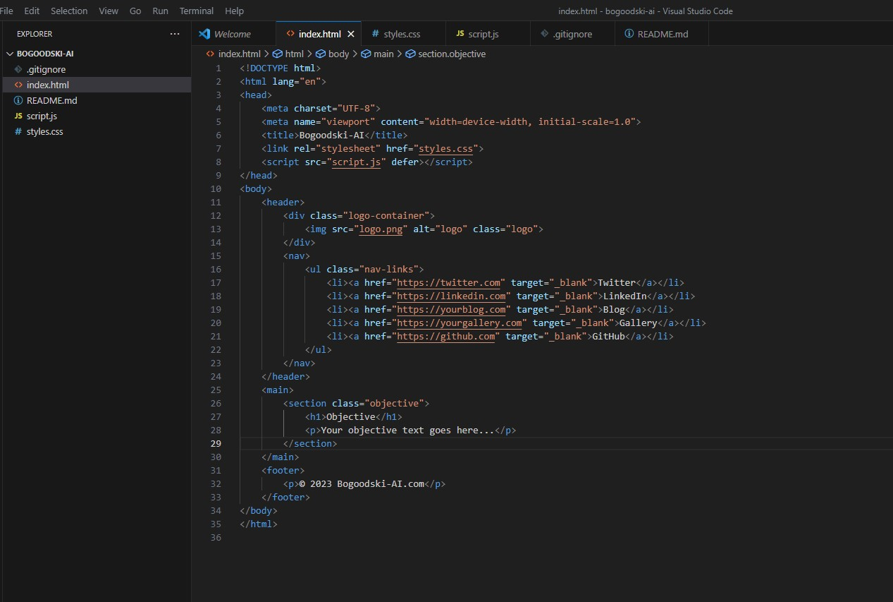

# BOGOODSKI-AI Portfolio Website

This project is a portfolio website built with HTML, CSS, and vanilla JavaScript. It's deployable to Azure App Service and designed to be fully responsive across various device screen sizes.

## Objective

The main objective of this project is to utilize generative artificial intelligence, primarily ChatGPT, to generate a portfolio website. This approach leverages AI capabilities to streamline and enhance the web development process.

## Progress

- **Day 0: July 31, 2023:** 

## Features

- **Dynamic resizing:** The website layout adjusts dynamically to fit different device screen sizes.

- **Local development:** Utilize a quick python server to view website during development.

## Development Process

1. **Initial Prompt:** The project started with an initial prompt, outlining the requirements and objectives for the website.

2. **Initial Scaffold:** The website was scaffolded with basic HTML structure and CSS styling.

3. **ChatGPT Assistance:** ChatGPT was used to generate and refine the HTML, CSS, and JavaScript code for the website.

(TODO: Add any other steps or details about your development process)

## Deployment

The website will be deployed on Azure App Service. (TODO: Add a link to live site, when available)

## Future Enhancements

    * Add a gallery
    * Add a blog

## Credits

This project was created by [BOGOODSKI](https://www.linkedin.com/in/sbogucki12/).
